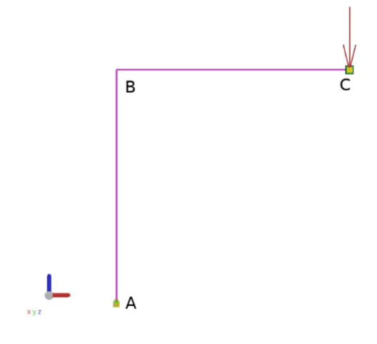
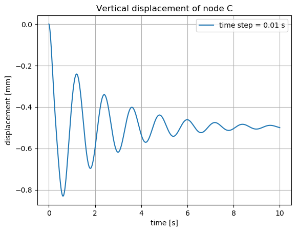
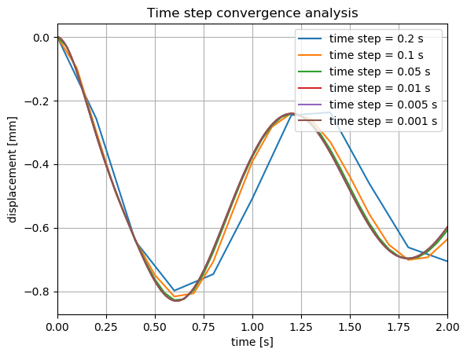

## Structural dynamic solver for 2D beam elements

## Problem

The purpose of this solver is to use 2D beam elements to calculate the vertical 
displacement of the node C defined on the figure below: 



A vertical force F is apllied at node C and the node A is fully constrained.

A Newmark algorithm is used to solve the problem dynamically.


## How to reproduce the code

```
cd ~
git clone https://github.com/RomainPinguet/akselos_romain_exercise.git
cd akselos_romain_exercise
python main.py 
```

## Results

The vertical displacement of the node C is shown on the figure below : 


A convergence analysis of the time step size for the Newmark algorithm has shown
that convergence is reached for a time step of 0.01s :

 
 
 To fully validate this model, a comparison with experimental measurements or 
 theoretical results should be done. 